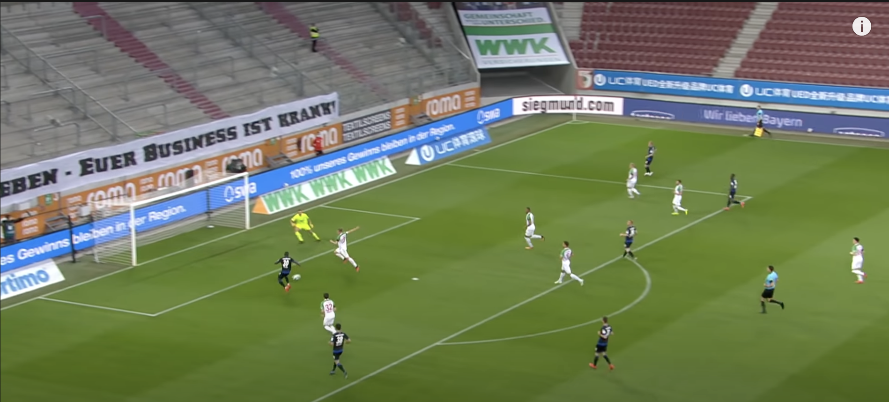

# soccer-shot-probability-calculator

This program allows you to input an image of a soccer game near a goal and will predict the probability of a player scoring given a certain position. The code uses a yolov5 model to find the player locations, and the user inputs the locaton ofthe goal, the ball, and the penalty spot to run the calculations. Currently guesses the pitch, roll, and yaw based on the image based on the orientation of the goalpost. The algorithm compares the difficulty of making a shot to the difficulty of making a penalty (which on average is a 75% scoring rate) to calculate the probability of making a shot.

## Running the code
Just download the python file and run `python calculate.py name_of_image`

## Future improvements
- Add proper image detection for ball and goalpost.
- Allow for video input.
- Implement proper camera model to get more precise 3d location (would need video only for this).
- Better overlap detection to see if a player is blocking the path to a the goal.
- Create model based on game state to estimate scoring probability instead of comparing difficulties.
